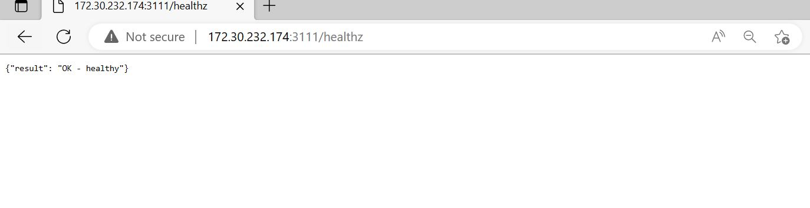
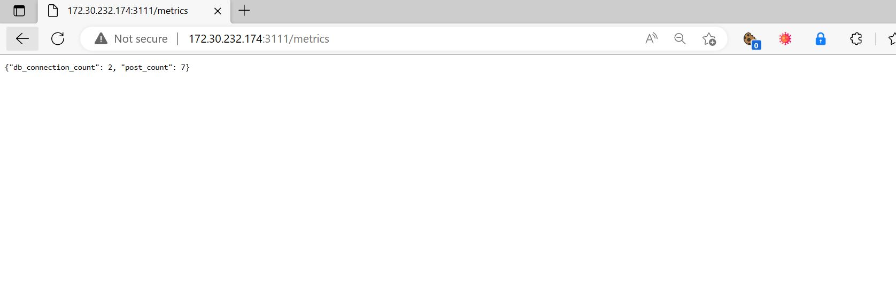
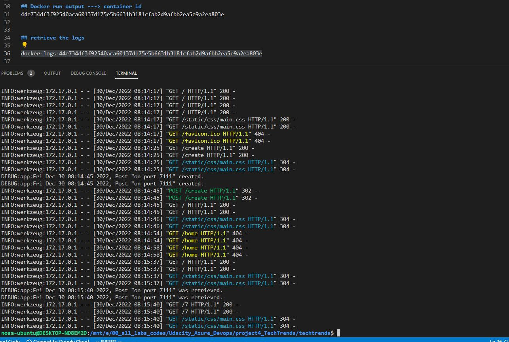

# project4_TechTrends
TechTrend

## Healthcheck endpoint and Metric endPoint
Build the /healthz endpoint for the TechTrends application. The endpoint should return the following response:

- An HTTP 200 status code
- A JSON response containing the result: OK - healthy message
Configure this in the app.py





## Docker file
docker login
```
Authenticating with existing credentials...
Login Succeeded
```

## To build the Application
docker build -t techtrends .

## To test and Run the Application
docker run -dp 7111:3111 techtrends

## Docker run Output
container ID: 44e734df3f92540aca60137d175e5b6631b3181cfab2d9afbb2ea5e9a2ea803

## Docker command to retrieve the logs 
docker logs 44e734df3f92540aca60137d175e5b6631b3181cfab2d9afbb2ea5e9a2ea803



## tag the image 
- create a repository called techtrends in your docker hub account
docker tag techtrends ernynany/techtrends:v1.0.0

## Docker command to push the images to dockerhub 
docker push ernynany/techtrends:v1.0.0

The push refers to repository [docker.io/ernynany/techtrends]
cc9f3e418d44: Pushed
b22588431674: Pushed 
3793841919b8: Pushed 
adf4f7dc7177: Pushed
757468f9631a: Mounted from library/python 
7935c88eee12: Mounted from library/python
cfbad9ad8a53: Mounted from library/python
248397b6b856: Mounted from library/python
fa1175420e6f: Mounted from library/python 
bb2453e12947: Mounted from library/python
7354e83da007: Mounted from library/python
c284f546974c: Mounted from library/python
4efcd4003c84: Mounted from library/python
v1.0.0: digest: sha256:6d27f9c9f66c8aa4aee94475d4c05c2fd0a4024aa0d4ffdda5a129ccaf5d5275 size: 3052


#STEP 2
##Conitnuous INtegration with Github ACtions
1 Create a new repo 
2. push your codes to the new repo 
3. Add the docker token and GitHub encrypted secrets from the project directory Goto settings > secret > Actions > click New repository secret 
4. create the techtrends-dockerhub.yml in the .github/workflows/ Might be created automatically when creating the github action. 
5. Goto Github Actions and click on the create a new workflow yourself button


# STEP 3
## Kubernetetes Declarative Manifests
Create a vigrant box and ssH into it

vagrant up
vagrant ssh


## Deploy the kubernetes cluster and give yourself root access

curl -sfL https://get.k3s.io | sh -
sudo su

## Get all nodes
kubectl get no

## Kubernetes Declarative manifest

touch namespace.yaml
touch deploy.yaml
vim deploy.yaml
touch service.yaml
vim service.yaml


kubectl apply -f namespace.yaml
kubectl apply -f deploy.yaml
kubectl apply -f service.yaml

## Get all KubeCtl namespace and get all running pods

kubectl get all -n sandbox
kubectl get po -A

# Step 4 : Helm Charts
Create the required templates and all the yaml.files as stated in the project 

# Step 5: ArgoCD Continuous Delivery
kubectl create namespace argocd
kubectl apply -n argocd -f https://raw.githubusercontent.com/argoproj/argo-cd/stable/manifests/install.yaml

## Get all pods and get all services
kubectl get po -n argocd
kubectl get svc -n argocd

Expose it to the internet using the argocd-server-nodeport.yaml from the following repo https://github.com/udacity/nd064_course_1/blob/main/solutions/argocd/argocd-server-nodeport.yaml

## Create, vim and apply 
touch argocd-server-nodeport.yaml
vim argocd-server-nodeport.yaml
kubectl apply -f argocd-server-nodeport.yaml

## access the ARGOCD UI
https://192.168.50.4:30008 or http://192.168.50.4:30007 

## Login and password
username: admin

password: run command kubectl -n argocd get secret argocd-initial-admin-secret -o jsonpath="{.data.password}" | base64 -d; echo

type in the gebnerated command

## Create, vim and Apply staging and prod yaml files
touch helm-techtrends-staging.yaml
vim helm-techtrends-staging.yaml

touch helm-techtrends-prod.yaml
vim helm-techtrends-prod.yaml

kubectl apply -f helm-techtrends-staging.yaml
kubectl apply -f helm-techtrends-prod.yaml

remember to sync the staging and prod from the ARGOCD UI
